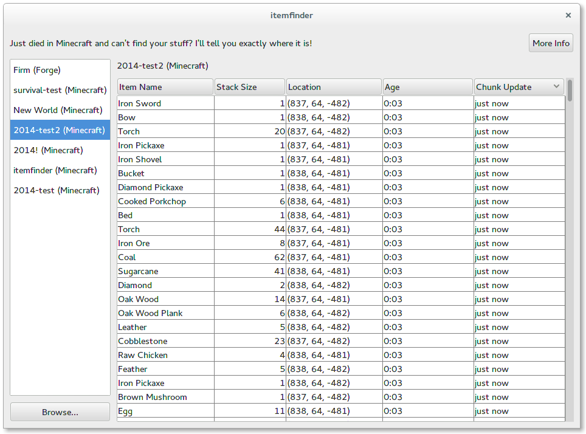

itemfinder
==========

Just died in Minecraft, and can't find your stuff? This tool will show it to you.

How it works
------------

This tool scans your minecraft worlds for items that lie on the ground and displays them
in a sortable list. The default ordering shows items that have been recently dropped at
the top, so if you just died, your stuff should be easy to find. The coordinates will then
tell you exactly where you have to look for them. Keep an eye on the age, if it reaches 5:00,
the item will despawn.

Building
--------

You need maven and java 1.7 installed. Then just do:

    mvn clean install`

This will download the dependencies and create the file `target/itemfinder-xxx-jar-with-dependencies.jar`.
Just open this file with java.

Source Code available under Apache License 2.0. (C) Jan Melcher, 2014.
